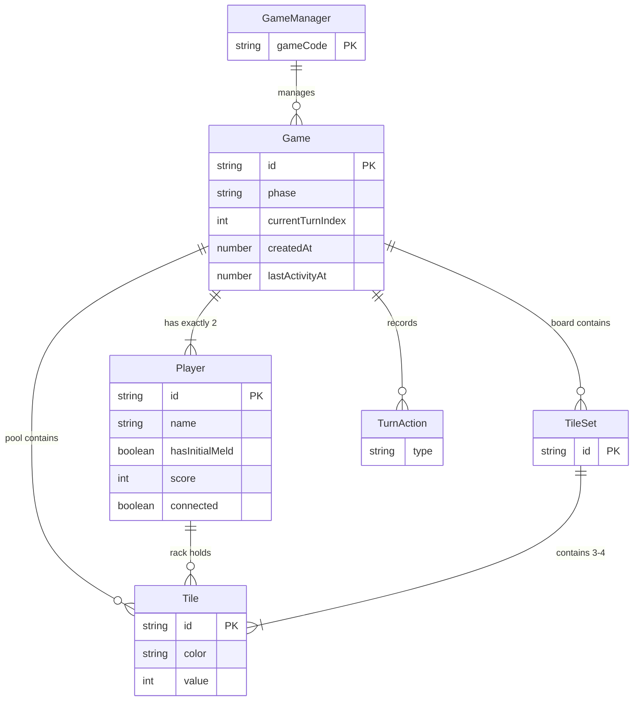

# Entity Model

## Entities

| Entity | Description |
|--------|-------------|
| **Tile** | A numbered game piece with a color and value. Uniquely identified by `id` (e.g., `"red-7-a"`). Exists in one of three locations: a player's rack, a tile set on the board, or the pool. |
| **TileSet** | A valid grouping of tiles on the board — either a **run** (3+ consecutive same-color tiles) or a **group** (3–4 same-value tiles in distinct colors). |
| **Player** | A participant in a game. Owns a rack of tiles (hidden from the opponent). Tracks whether the player has completed their initial meld and their score. |
| **Pool** | The draw pile of face-down tiles shared by both players. Represented as an ordered list of tiles; players draw from the top. |
| **Game** | The top-level aggregate root. Owns all other entities. Tracks the game phase (lobby → playing → ended), whose turn it is, the board, the pool, and a log of the current turn's actions. |
| **TurnAction** | A record of a single action within the current turn — either placing a set of tiles on the board or drawing a tile. Cleared when the turn ends. Used to enforce initial-meld rules and will support undo in Phase 2. |
| **GameManager** | A singleton registry that maps game codes to `Game` instances. Responsible for generating unique game codes and providing lookup. Not persisted (in-memory only). |

## Relationships

| Relationship | Cardinality | Description |
|-------------|-------------|-------------|
| Game → Player | 1:N (exactly 2) | A game has exactly two players once started. |
| Game → TileSet | 1:N | A game's board contains zero or more tile sets. |
| Game → Tile (pool) | 1:N | A game's pool contains zero or more tiles available to draw. |
| Game → TurnAction | 1:N | A game records the actions taken during the current turn. Cleared on turn end. |
| Player → Tile (rack) | 1:N | A player's rack holds their private tiles (0–14+ tiles). |
| TileSet → Tile | 1:N (3–4) | A tile set contains 3 or 4 tiles that form a valid run or group. |
| GameManager → Game | 1:N | The manager holds all active games indexed by game code. |

## Entity-Relationship Diagram

