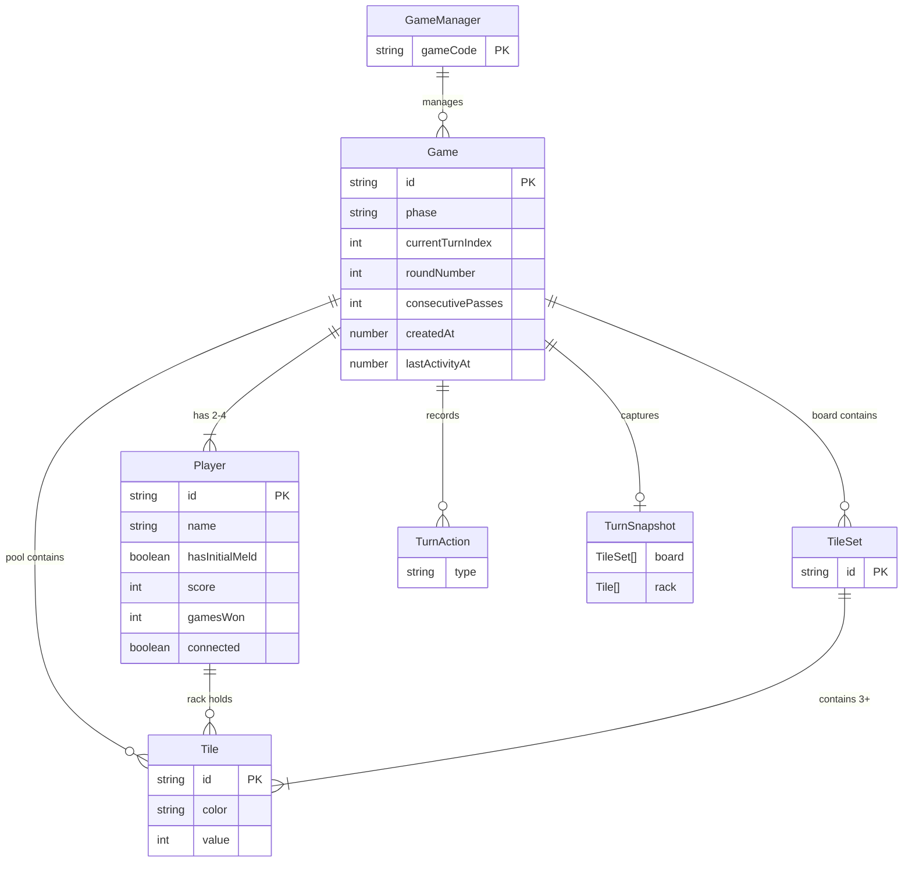

# Entity Model

## Entities

| Entity | Description |
|--------|-------------|
| **Tile** | A numbered game piece with a color and value. Uniquely identified by `id` (e.g., `"red-7-a"`, `"joker-1"`). Joker tiles have `color: "joker"` and `value: 0`. Exists in one of three locations: a player's rack, a tile set on the board, or the pool. |
| **TileSet** | A valid grouping of tiles on the board — either a **run** (3+ consecutive same-color tiles, jokers may substitute for missing values) or a **group** (3–4 same-value tiles in distinct colors, at most one joker). |
| **Player** | A participant in a game. Owns a rack of tiles (hidden from the opponent). Tracks whether the player has completed their initial meld, their cumulative score, and number of rounds won (`gamesWon`). May be an AI player (`isAI`) configured with a model name. |
| **Pool** | The draw pile of face-down tiles shared by both players. Represented as an ordered list of tiles; players draw from the top. |
| **Game** | The top-level aggregate root. Owns all other entities. Tracks the game phase (lobby → playing → ended), whose turn it is, the board, the pool, a log of the current turn's actions, and a turn snapshot for undo. Tracks `roundNumber` (increments on Play Again) and `consecutivePasses` for stalemate detection. |
| **TurnAction** | A record of a single action within the current turn — placing a set of tiles (`placeSet`), drawing a tile (`draw`), manipulating the board (`manipulate`), or passing (`pass`). Cleared when the turn ends. Used to enforce initial-meld rules and track whether a player has acted this turn. |
| **TurnSnapshot** | A capture of the board and current player's rack at the start of a turn. Used by undo to revert all changes made during the turn. Null at the start of a turn; created on first action. |
| **GameManager** | A singleton registry that maps game codes to `Game` instances. Responsible for generating unique game codes, providing lookup, and periodically cleaning up games inactive for over 24 hours. Not persisted (in-memory only). |
| **SetValidationError** | A structured validation error for an invalid tile set. Contains the set ID, a machine-readable reason code (`SetValidationReason`), and a human-readable message. Produced by `getSetValidationError` and `getBoardValidationErrors` in the shared package. |
| **AiProvider** | Pluggable turn-taker: scripted or LLM; invoked by the AiTurnRunner through an AiTurnController. |
| **LlmProvider** | Tool-calling AI agent (`AI_PROVIDER=llm`). Runs an agent loop against an OpenAI-compatible chat completions endpoint: the model receives a system prompt (rules + its private state) and takes its turn by calling tools that map 1:1 to the AiTurnController verbs (`get_game_state`, `play_sets`, `manipulate_board`, `undo_turn`, `draw_tile`, `end_turn`, `pass_turn`). Rejections are returned as tool-result errors so the model can retry. Its **conversation** is the ordered list of messages (system prompt, turn-start notes, assistant replies, tool results) kept per game/round/player and reset on Play Again. Every request, response, tool call and tool result is logged as JSON lines to the server console. |
| **AiTurnController** | Server-side facade over the Game class with identical authority to socket handlers; returns errors as values instead of events. |
| **AiTurnRunner** | Registry that triggers provider runs when the current player is AI; records AI errors and emits `ai:error`. |

## Relationships

| Relationship | Cardinality | Description |
|-------------|-------------|-------------|
| Game → Player | 1:N (2-4) | A game has 2-4 players once started. |
| Game → TileSet | 1:N | A game's board contains zero or more tile sets. |
| Game → Tile (pool) | 1:N | A game's pool contains zero or more tiles available to draw. |
| Game → TurnAction | 1:N | A game records the actions taken during the current turn. Cleared on turn end. |
| Game → TurnSnapshot | 1:0..1 | A game has at most one turn snapshot (created on first action, cleared on turn end). |
| Game → AiTurnController | 1:0..N | A game has an AiTurnController per AI player during AI turns. |
| Game → LlmProvider conversation | 1:0..N per AI player | Each AI player in a game has its own LLM conversation (ordered messages), keyed by game code, round number and player id; reset when a new round starts. |
| AiTurnRunner → Game | 1:N | The runner triggers AI turns across all active games. |
| Player → Tile (rack) | 1:N | A player's rack holds their private tiles (0–14+ tiles). |
| TileSet → Tile | 1:N (3+) | A tile set contains 3 or more tiles that form a valid run or group. |
| GameManager → Game | 1:N | The manager holds all active games indexed by game code. |
| Board validation → SetValidationError | 1:0..N | A board validation produces zero or more errors, one per invalid set. |

## Entity-Relationship Diagram

## See Also

- [rules.md](rules.md) — MUST read before planning changes to game behaviour. Defines the rules that govern entity validation.
- [prd.md](prd.md) — MUST read for the game state model TypeScript interfaces and entity design decisions.
- [coding.md](coding.md) — MUST read before making code changes. Contains architecture rules about shared types.
- [testing.md](testing.md) — MUST read when writing tests that involve game data structures.
- [bug_fixing.md](bug_fixing.md) — MUST read when debugging data structure issues or entity relationship problems.
